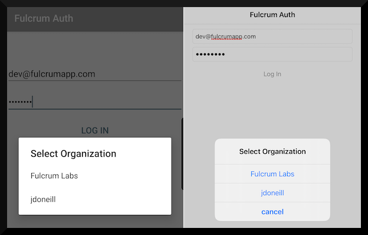

# Fulcrum Auth
![badge][badge-android]
![badge][badge-ios]
![badge][badge-js]

Kotlin Multiplatform app containing authentication with [Fulcrum](https://www.fulcrumapp.com/)

## Dependencies
 - [Kotlin Coroutines](https://kotlinlang.org/docs/reference/coroutines-overview.html)
 - [Kotlin Ktor](https://ktor.io/clients/index.html)
 - [Kotlin Serialization](https://github.com/Kotlin/kotlinx.serialization)
 - [SQLDelight](https://cashapp.github.io/sqldelight/)

## Licensing
A copy of the license is available in the repository's [LICENSE](LICENSE) file.

[badge-android]: http://img.shields.io/badge/platform-android-6EDB8D.svg?style=flat
[badge-ios]: http://img.shields.io/badge/platform-ios-CDCDCD.svg?style=flat
[badge-js]: http://img.shields.io/badge/platform-js-F8DB5D.svg?style=flat
